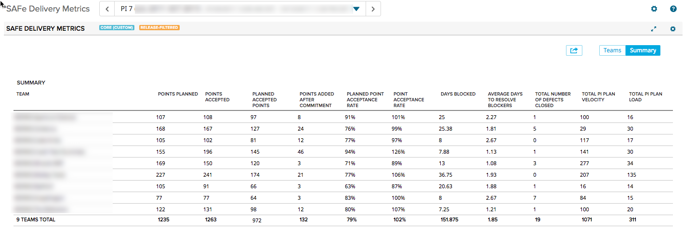
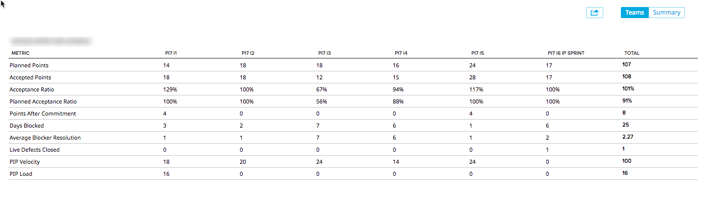

# SAFe Delivery Metrics

## Summary/Description
This app responds to a Release scoped dashboard to show SAFe metrics for the selected Program Increment.  Metrics are listed below.  

### Summary View

### Team View 

The dataset used in this app is all user stories and defects in leaf projects (projects with no children) associated with an iteration that overlaps with the selected release date boundaries.  The story or defect does not need to be explicitly associated with the release if it is explicitly associated with an iteration that overlaps with the release boundaries.  

### Planned Points
The number of points associated with the iteration at the number of days offset from the Iteration (see Days Offset from Iteration App Setting).

### Accepted Points
The number of accepted points currently associated with the iteration.  This means that if points were accepted AFTER the iteration, they are still included here.  

### Acceptance ratio
The number of Accepted points currently associated with the iteration divided by the Planned Points for the iteration.  

### Planned Acceptance Ratio
The number of accepted points currently associated with the iteration that are associated with work items included in the original Planned Points calculation (see Planned Points).  Note that if the Plan Estimate for a planned story increased or decreased since the planned date, then the latest change will be included in the Planned Acceptance Ratio calculation.  

### Points After Commitment
The number of accepted points currently associated with the iteration minus the Planned Points for the iteration at the number of days offset from the Iteration (see Days Offset from Iteration App Setting)  NOTE that this assumes that all points associated with an older iteration are currently accepted.  If there are unaccepted points in an iteration, then the points added after commitment may not reflect the accurate number.  Also, if points were removed from the iteration, this number will represent the net addition.  If more points were removed than added and the resulting number is less than 0, then this number will be 0.   

### Days Blocked
The cumulative approximation of number of days blocked.  This is calculated as follows:
If the blocked time is less than 8 hours for a blocked duration, then the blocked time will be the fraction of an 8 hour day that represents.  (e.g. blocked for 2 hours will result in .25 days of blocked time).

If blocked time is greater than 8 hours, and less than 36, then blocked time will be 1 day.
36 hours to 60 hours -- 2 days.

Blocked time will exclude weekends, so an item blocked from 5:00 PM on Friday and unblocked at 8 AM on Monday will result in 15 hours blocked time, which will render as 1 day.  

### Average Blocker Resolution
Average number of days to resolve a blocker. This is a mean of all blocker durations.  If an item was blocked and unblocked twice, then the average time to resolve that blocker would be the average of the two durations for that blocker.  It is not cumulative.  

### PI Planned Velocity
This is the value of the Planned Velocity set for the iteration at the moment in time that represents the number of days offset from the selected Release (see Days Offset from Release App Setting).  This value is calculated from
parsing the Revision History for the Iteration object.  

### PI Planned Load
This is the sum of the story points for all stories and defects explicitly associated with the iteration
at the moment in time that represents the number of days offset from the selected Release (see Days Offset from Release App Setting).

## App Settings
### Days Offset from Iteration
The number of days from the beginning of the iteration that represents the point at which we calculate the planned points.

### Days Offset from Release
The number of days from the beginning of the release that represents the point at which we calculate the planned points for the release.

### Defect Tags
Tags associated with Defects to include in the Live Defects Closed calculation.

## Caveats:  
If an artifact was accepted within the sprint boundaries and then moved from the sprint, it will not be counted in the accepted points in the sprint since we are using the currently accepted points for work items associated with the sprint.

## Development Notes

### First Load

If you've just downloaded this from github and you want to do development,
you're going to need to have these installed:

 * node.js
 * grunt-cli
 * grunt-init

Since you're getting this from github, we assume you have the command line
version of git also installed.  If not, go get git.

If you have those three installed, just type this in the root directory here
to get set up to develop:

  npm install

#### Deployment & Tests

If you want to use the automatic deployment mechanism, be sure to use the
**makeauth** task with grunt to create a local file that is used to connect
to Rally.  This resulting auth.json file should NOT be checked in.

### Structure

  * src/javascript:  All the JS files saved here will be compiled into the
  target html file
  * src/style: All of the stylesheets saved here will be compiled into the
  target html file
  * test/fast: Fast jasmine tests go here.  There should also be a helper
  file that is loaded first for creating mocks and doing other shortcuts
  (fastHelper.js) **Tests should be in a file named <something>-spec.js**
  * test/slow: Slow jasmine tests go here.  There should also be a helper
  file that is loaded first for creating mocks and doing other shortcuts
  (slowHelper.js) **Tests should be in a file named <something>-spec.js**
  * templates: This is where templates that are used to create the production
  and debug html files live.  The advantage of using these templates is that
  you can configure the behavior of the html around the JS.
  * config.json: This file contains the configuration settings necessary to
  create the debug and production html files.  
  * package.json: This file lists the dependencies for grunt
  * auth.json: This file should NOT be checked in.  This file is needed for deploying
  and testing.  You can use the makeauth task to create this or build it by hand in this'
  format:
    {
        "username":"you@company.com",
        "password":"secret",
        "server": "https://rally1.rallydev.com"
    }

### Usage of the grunt file
#### Tasks

##### grunt debug

Use grunt debug to create the debug html file.  You only need to run this when you have added new files to
the src directories.

##### grunt build

Use grunt build to create the production html file.  We still have to copy the html file to a panel to test.

##### grunt test-fast

Use grunt test-fast to run the Jasmine tests in the fast directory.  Typically, the tests in the fast
directory are more pure unit tests and do not need to connect to Rally.

##### grunt test-slow

Use grunt test-slow to run the Jasmine tests in the slow directory.  Typically, the tests in the slow
directory are more like integration tests in that they require connecting to Rally and interacting with
data.

##### grunt deploy

Use grunt deploy to build the deploy file and then install it into a new page/app in Rally.  It will create the page on the Home tab and then add a custom html app to the page.  The page will be named using the "name" key in the config.json file (with an asterisk prepended).

You can use the makeauth task to create this file OR construct it by hand.  Caution: the
makeauth task will delete this file.

The auth.json file must contain the following keys:
{
    "username": "fred@fred.com",
    "password": "fredfredfred",
    "server": "https://us1.rallydev.com"
}

(Use your username and password, of course.)  NOTE: not sure why yet, but this task does not work against the demo environments.  Also, .gitignore is configured so that this file does not get committed.  Do not commit this file with a password in it!

When the first install is complete, the script will add the ObjectIDs of the page and panel to the auth.json file, so that it looks like this:

{
    "username": "fred@fred.com",
    "password": "fredfredfred",
    "server": "https://us1.rallydev.com",
    "pageOid": "52339218186",
    "panelOid": 52339218188
}

On subsequent installs, the script will write to this same page/app. Remove the
pageOid and panelOid lines to install in a new place.  CAUTION:  Currently, error checking is not enabled, so it will fail silently.

##### grunt watch

Run this to watch files (js and css).  When a file is saved, the task will automatically build, run fast tests, and deploy as shown in the deploy section above.

##### grunt makeauth

This task will create an auth.json file in the proper format for you.  **Be careful** this will delete any existing auth.json file.  See **grunt deploy** to see the contents and use of this file.

##### grunt --help  

Get a full listing of available targets.
